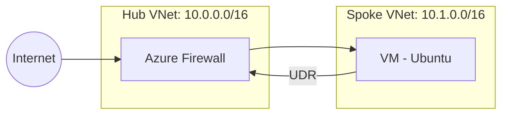
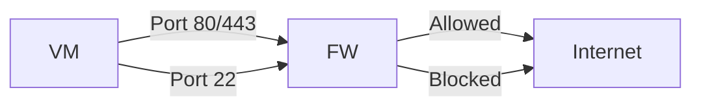
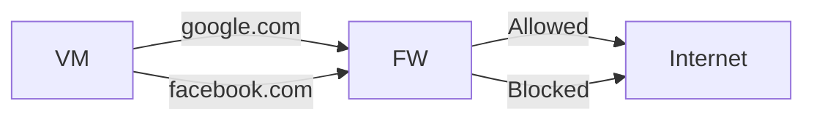
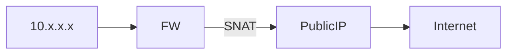
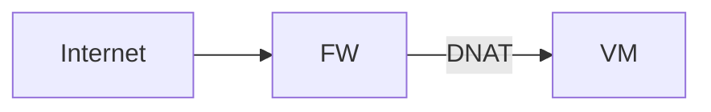
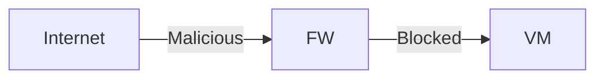
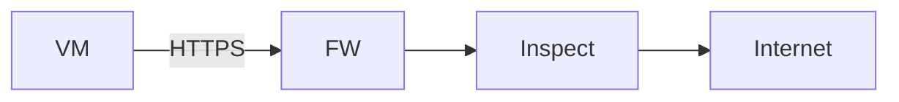
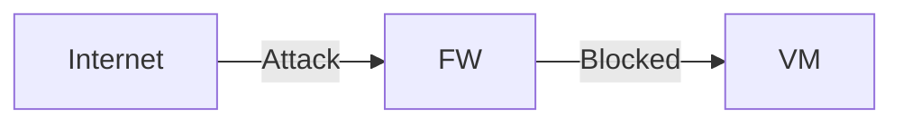
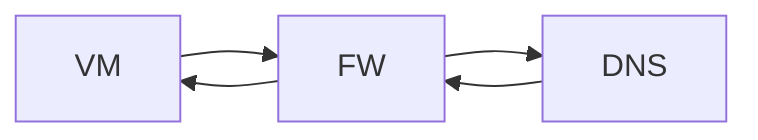
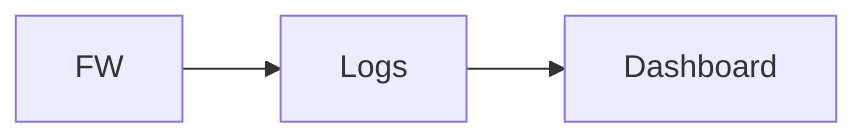

# 🔥 Azure Firewall – Complete Practice, Architecture & Features Guide

---

# 🎯 Objective

Learn and implement **Azure Firewall** with:

* Architecture (Hub-Spoke)
* Features (with diagrams)
* Hands-on lab (CLI)
* Plan comparison
* Exam & interview readiness

---

# 🧱 Architecture (Hub-Spoke Model)



---

# 🧭 Traffic Flow (Exam Concept)

1. VM sends request
2. Route Table (UDR) → Azure Firewall
3. Firewall evaluates rules
4. Allow / Deny
5. Traffic flows

---

# 🔥 Azure Firewall Plans Comparison

| Feature             | Basic    | Standard   | Premium    |
| ------------------- | -------- | ---------- | ---------- |
| Use Case            | Dev/Test | Production | Enterprise |
| Network Rules       | ✅        | ✅          | ✅          |
| Application Rules   | ❌        | ✅          | ✅          |
| Threat Intelligence | ❌        | ✅          | ✅          |
| TLS Inspection      | ❌        | ❌          | ✅          |
| IDPS                | ❌        | ❌          | ✅          |
| URL Filtering       | ❌        | ❌          | ✅          |
| DNS Proxy           | ❌        | ✅          | ✅          |
| Availability Zones  | ❌        | ✅          | ✅          |

---

# 🧠 Plan Selection

* **Basic → Labs / Cost saving**
* **Standard → Default production**
* **Premium → Security heavy workloads**

---

# 🔥 Azure Firewall Features (With Diagrams)

---

## 🌐 1. Network Rules (L3/L4)

**Explanation:**
Filter traffic using IP, Port, Protocol



---

## 🌍 2. Application Rules (L7)

**Explanation:**
Allow/deny based on domain (FQDN)



---

## 🔁 3. SNAT (Outbound)

**Explanation:**
Private IP → Public IP for internet access



---

## 🔓 4. DNAT (Inbound)

**Explanation:**
Public IP → Private VM



---

## 🛡️ 5. Threat Intelligence

**Explanation:**
Block malicious IPs/domains using Microsoft feed



---

## 🔐 6. TLS Inspection (Premium)

**Explanation:**
Decrypt → Inspect → Re-encrypt HTTPS traffic



---

## 🚨 7. IDPS (Premium)

**Explanation:**
Detect & block attacks (SQL injection, exploits)



---

## 🌐 8. DNS Proxy

**Explanation:**
Central DNS resolution for FQDN filtering



---

## 📊 9. Logging & Monitoring

**Explanation:**
Track traffic using Azure Monitor



---

# 🚀 Hands-On Lab (CLI)

---

## 🧩 Resource Group

```bash
az group create -n rg-firewall-lab -l centralindia
```

---

## 🌐 Hub VNet

```bash
az network vnet create \
-n vnet-hub \
-g rg-firewall-lab \
--address-prefix 10.0.0.0/16 \
--subnet-name AzureFirewallSubnet \
--subnet-prefix 10.0.1.0/24
```

---

## 🌐 Spoke VNet

```bash
az network vnet create \
-n vnet-spoke \
-g rg-firewall-lab \
--address-prefix 10.1.0.0/16 \
--subnet-name AppSubnet \
--subnet-prefix 10.1.1.0/24
```

---

## 🔗 VNet Peering

```bash
az network vnet peering create \
-n hub-to-spoke \
-g rg-firewall-lab \
--vnet-name vnet-hub \
--remote-vnet vnet-spoke \
--allow-vnet-access
```

```bash
az network vnet peering create \
-n spoke-to-hub \
-g rg-firewall-lab \
--vnet-name vnet-spoke \
--remote-vnet vnet-hub \
--allow-vnet-access
```

---

## 🌍 Public IP

```bash
az network public-ip create \
-n fw-pip -g rg-firewall-lab --sku Standard
```

---

## 🔥 Firewall

```bash
az network firewall create \
-n az-firewall -g rg-firewall-lab -l centralindia
```

```bash
az network firewall ip-config create \
--firewall-name az-firewall \
--name fw-config \
--public-ip-address fw-pip \
--resource-group rg-firewall-lab \
--vnet-name vnet-hub
```

---

## 🖥️ VM

```bash
az vm create \
-n vm-test \
-g rg-firewall-lab \
--image Ubuntu2204 \
--vnet-name vnet-spoke \
--subnet AppSubnet \
--admin-username azureuser \
--generate-ssh-keys
```

---

## 🔀 Route Table

```bash
az network route-table create -n rt-firewall -g rg-firewall-lab
```

```bash
az network firewall show \
-n az-firewall -g rg-firewall-lab \
--query "ipConfigurations[0].privateIpAddress" -o tsv
```

```bash
az network route-table route create \
-g rg-firewall-lab \
--route-table-name rt-firewall \
-n default-route \
--address-prefix 0.0.0.0/0 \
--next-hop-type VirtualAppliance \
--next-hop-ip-address <FIREWALL_PRIVATE_IP>
```

```bash
az network vnet subnet update \
-n AppSubnet \
--vnet-name vnet-spoke \
-g rg-firewall-lab \
--route-table rt-firewall
```

---

## 📜 Firewall Rules

```bash
# Allow HTTP/HTTPS
az network firewall network-rule create \
--firewall-name az-firewall \
--resource-group rg-firewall-lab \
--collection-name allow-web \
--name allow-http-https \
--protocols TCP \
--source-addresses "*" \
--destination-addresses "*" \
--destination-ports 80 443 \
--action Allow \
--priority 100
```

```bash
# Deny All
az network firewall network-rule create \
--firewall-name az-firewall \
--resource-group rg-firewall-lab \
--collection-name deny-all \
--name deny-all-rule \
--protocols Any \
--source-addresses "*" \
--destination-addresses "*" \
--destination-ports "*" \
--action Deny \
--priority 200
```

---

# 🧪 Validation

```bash
ssh azureuser@<VM_PUBLIC_IP>

curl http://google.com   # Allowed
ping google.com          # Blocked
```

---

# 📊 Logging

```bash
az monitor diagnostic-settings create \
--name fw-logs \
--resource $(az network firewall show --name az-firewall --resource-group rg-firewall-lab --query id -o tsv) \
--workspace <LOG_ANALYTICS_ID> \
--logs '[{"category":"AzureFirewallNetworkRule","enabled":true}]'
```

---

# ⚠️ Points to Remember (🔥 Exam)

* Firewall is **stateful**
* Default = **Deny**
* Use **AzureFirewallSubnet (mandatory name)**
* Requires **UDR**
* Standard Public IP only
* Premium → TLS + IDPS
* Rules processed by priority

---

# 🧠 Real-World Use Cases

* Hub-Spoke security
* Zero Trust
* Outbound restriction
* Enterprise compliance

---

# 🚀 Advanced Topics

* Azure Firewall Manager
* Private Endpoints
* Hybrid connectivity
* Multi-region firewall

---

# 🧹 Cleanup

```bash
az group delete -n rg-firewall-lab --yes --no-wait
```

---

# 💡 Final Trainer Shortcut

👉 Interview one-liner:

* L3/L4 → Network Rules
* L7 → Application Rules
* SNAT → Outbound
* DNAT → Inbound
* Premium → Advanced Security

---

# 📋 Previous Lab Notes

## What looks good

* **UDR via firewall**: Associating `fw-dg` to `Workload-SN` and sending `0.0.0.0/0` to the firewall’s **private** IP (next-hop **Virtual appliance**) is correct. ([Microsoft Learn][1])
* **Rules layout**: App rule to allow only `www.google.com`, network rule for DNS to external resolvers, and DNAT for RDP through the firewall public IP aligns with the tutorials. ([Microsoft Learn][2])

# Issues to fix (important)

1. **Firewall subnet naming & size**
   Create a **dedicated subnet named exactly `AzureFirewallSubnet`** (recommended **/26**) for the firewall. Don’t place the firewall in a generic subnet. If you ever enable forced tunneling or Premium management, you’ll also need `AzureFirewallManagementSubnet`. ([Microsoft Learn][3])

2. **Addressing mismatch**
   You used firewall private IP `10.0.1.4` → implies a firewall subnet like `10.0.1.0/x`.
   But DNAT targets `Srv-Work` at **10.0.0.4**, while your workload subnet is `10.0.2.0/24`. Pick one scheme and stick to it. (Example below.)

3. **DNAT + NSG interaction**
   DNAT doesn’t bypass the VM/subnet NSG. Your VM “no inbound rules” will block RDP **after** translation. Add an NSG rule on `Srv-Work` NIC/subnet to **allow TCP/3389 from your client public IP** (or a narrow source), or temporarily from any for the lab. ([Microsoft Learn][4])

4. **Required public IP for the firewall**
   Make sure the firewall has a **Standard, Static** public IP attached for DNAT to work. (You’ve listed one; just confirm it’s bound to the firewall.) ([Microsoft Learn][2])

5. **DNS—two cleaner options**

* **Simple (what you’re doing):** VM uses external DNS (209.244.0.3/4). Keep your **Network rule** (UDP 53) and the UDR will hairpin via firewall.
* **Cleaner (recommended):** Enable **DNS Proxy** on Azure Firewall, point the VM to the firewall **as DNS** (or keep Azure DNS), and let the firewall forward/inspect. This simplifies rules and keeps DNS egress consistent. ([Microsoft Learn][5])

6. **Premium with Policy**
   You can deploy **Premium SKU + Firewall Policy** (you’re doing this) — just ensure the policy is **associated** and your rule collection groups priorities don’t collide. For prod, hub-and-spoke is preferred. ([Microsoft Learn][6])

# “Gold” corrected layout (one-VNet lab)

**VNet:** `Test-FW-VN` — address space: `10.0.0.0/16`

* **Subnet (Firewall):** `AzureFirewallSubnet` → `10.0.1.0/26`
* **Subnet (Workload):** `Workload-SN` → `10.0.2.0/24`
* **Firewall private IP (example):** `10.0.1.4`
* **Srv-Work private IP (example):** `10.0.2.4` ← **update your DNAT target to this**

**Route table `fw-dg` (associate to `Workload-SN`):**

* `0.0.0.0/0` → **Virtual appliance** → `10.0.1.4` (firewall private IP). ([Microsoft Learn][1])

**Firewall Policy (Premium) rules:**

* **Application RC** (prio 200) → **Allow** `www.google.com`, protocols `http, https`, source `10.0.2.0/24`.
* **Network RC** (prio 200) → **Allow** UDP/53, source `10.0.2.0/24`, destination `209.244.0.3,209.244.0.4`.

  * *(Alternative: enable DNS Proxy on firewall and point VM DNS to firewall.)* ([Microsoft Learn][5])
* **DNAT RC** → Name `RDP`, **Dest:** firewall **public** IP, **TCP/3389**, **Translated IP:** `10.0.2.4`, **Port:** `3389`. DNAT auto-adds corresponding allow network rule. ([Microsoft Learn][4])

**NSGs:**

* **No NSG** on `AzureFirewallSubnet`. It’s managed by the platform. ([Microsoft Learn][7])
* On `Workload-SN` and/or `Srv-Work` NIC: **Allow inbound TCP/3389** from **your client public IP**.

**VM:**

* Windows Server 2019, no public IP (correct).
* Local Windows firewall usually allows RDP when enabled; confirm the rule is on.

# Test & troubleshooting checklist

* **Flush DNS** in the VM after changing DNS settings: `ipconfig /flushdns`. (A reboot also clears resolver cache; your Step 13 is fine.)
* **RDP via firewall public IP** → login to `Srv-Work`. If it fails, check (in order):

  1. NSG on NIC/subnet allowing 3389 from your client IP.
  2. DNAT rule points to **10.0.2.4** (not 10.0.0.4).
  3. Firewall public IP bound & healthy; policy **associated** to firewall.
  4. UDR on `Workload-SN` set to **10.0.1.4**.
* **Outbound test in Edge:**

  * `https://www.google.com` → **Allowed** (App rule).
  * `https://www.microsoft.com` → **Blocked** (no matching App rule).
* If DNS fails: temporarily switch VM DNS to `168.63.129.16` (Azure DNS) to isolate DNS vs. firewall issue; or enable **DNS Proxy** and point VM to the firewall. ([Microsoft Learn][5])

# Optional “pro” enhancements (quick wins)

* **Diagnostics & Logs:** Send Azure Firewall logs to **Log Analytics** for rule hits and DNAT troubleshooting. (Highly recommended in labs and prod.) ([Microsoft Learn][2])
* **Premium features:** Try **TLS Inspection** and **IDPS** (needs certificates, outbound HTTPS decryption). ([Microsoft Learn][6])
* **Architecture:** For production, move to **hub-and-spoke** with the firewall in the hub. ([Microsoft Learn][8])

---


[1]: https://learn.microsoft.com/en-us/azure/virtual-network/virtual-networks-udr-overview?utm_source=chatgpt.com "Azure virtual network traffic routing"
[2]: https://learn.microsoft.com/en-us/azure/firewall/tutorial-firewall-deploy-portal?utm_source=chatgpt.com "Deploy & configure Azure Firewall using the Azure portal"
[3]: https://learn.microsoft.com/en-us/azure/well-architected/service-guides/azure-firewall?utm_source=chatgpt.com "Architecture Best Practices for Azure Firewall"
[4]: https://learn.microsoft.com/en-us/azure/firewall/tutorial-firewall-dnat?utm_source=chatgpt.com "Filter inbound Internet or intranet traffic with Azure Firewall ..."
[5]: https://learn.microsoft.com/en-us/azure/firewall/dns-settings?utm_source=chatgpt.com "Azure Firewall DNS settings"
[6]: https://learn.microsoft.com/en-us/azure/firewall/tutorial-firewall-deploy-portal-policy?utm_source=chatgpt.com "Tutorial: Deploy & configure Azure Firewall and policy ..."
[7]: https://learn.microsoft.com/en-us/azure/firewall/firewall-faq?utm_source=chatgpt.com "Azure Firewall FAQ"
[8]: https://learn.microsoft.com/en-us/azure/firewall/tutorial-hybrid-portal-policy?utm_source=chatgpt.com "Deploy and configure Azure Firewall and policy in a hybrid ..."
