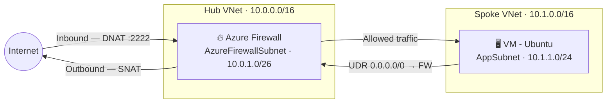
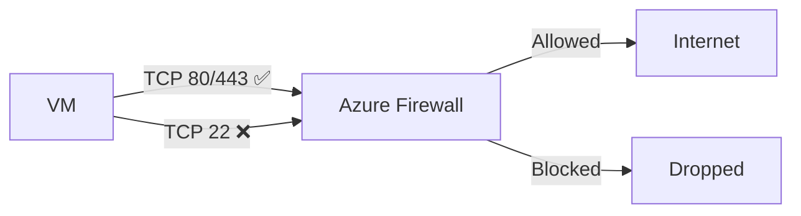
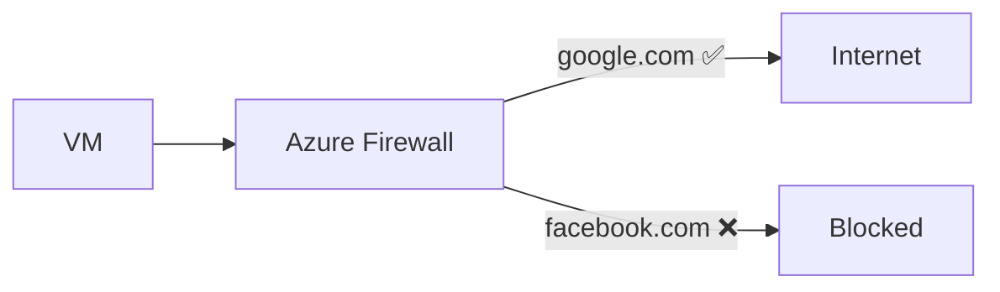
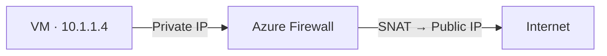
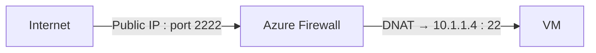
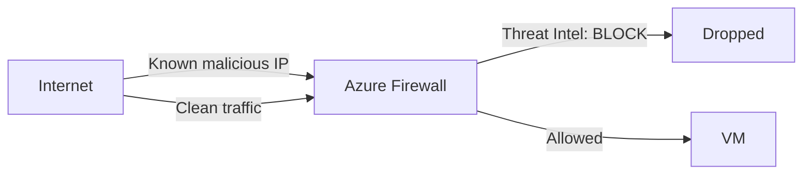
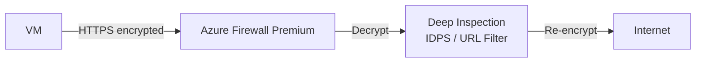
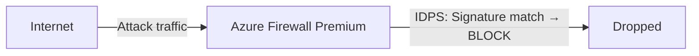
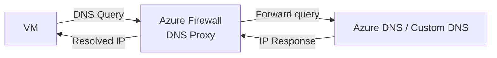
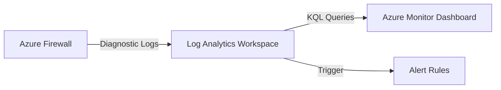

# 🔥 Azure Firewall – Complete Practice, Architecture & Features Guide

---

## 🎯 Objective

Learn and implement **Azure Firewall** end-to-end with:

- Architecture (Hub-Spoke model)
- Feature explanations with diagrams
- Validated hands-on lab (Azure CLI, step-by-step)
- SKU/Plan comparison
- Exam & interview prep

---

## 🧱 Architecture: Hub-Spoke Model

The firewall lives in the **Hub VNet**. All spoke traffic is forced through it via a **User Defined Route (UDR)**. VMs have no public IP — inbound access is via DNAT on the firewall.



---

## 🧭 Traffic Flow (Exam Concept)

**Outbound (VM → Internet):**
```
VM → UDR → Azure Firewall → Evaluate Rules → Allow/Deny → Internet (SNAT)
```

**Inbound (Internet → VM):**
```
Internet → Firewall Public IP → DNAT Rule → VM Private IP
```

> ⚠️ Azure Firewall is **stateful** — return traffic is automatically allowed without an explicit rule.

---

## 🔥 Azure Firewall SKU Comparison

| Feature               | Basic    | Standard   | Premium    |
|-----------------------|----------|------------|------------|
| **Use Case**          | Dev/Test | Production | Enterprise |
| Network Rules (L3/L4) | ✅       | ✅          | ✅          |
| Application Rules (L7)| ❌       | ✅          | ✅          |
| Threat Intelligence   | ❌       | ✅          | ✅          |
| DNS Proxy             | ❌       | ✅          | ✅          |
| Availability Zones    | ❌       | ✅          | ✅          |
| TLS Inspection        | ❌       | ❌          | ✅          |
| IDPS                  | ❌       | ❌          | ✅          |
| URL Filtering         | ❌       | ❌          | ✅          |

**When to use:**
- **Basic** → Cost-conscious labs, non-production
- **Standard** → Default for production workloads
- **Premium** → Compliance, advanced threat protection, TLS inspection

---

## 🔥 Azure Firewall Features

---

### 🌐 1. Network Rules (L3/L4)

Filter traffic by **IP address, port, and protocol**.



> Example: Allow HTTP/HTTPS from spoke subnet, block all other ports.

---

### 🌍 2. Application Rules (L7)

Filter traffic by **FQDN (domain name)** — works at Layer 7.



> Requires **DNS Proxy** enabled on the firewall for FQDN resolution to work correctly.

---

### 🔁 3. SNAT – Outbound NAT

Translates **VM private IP → Firewall public IP** for internet access.



> All outbound traffic appears to originate from the firewall's public IP.

---

### 🔓 4. DNAT – Inbound NAT

Translates **Firewall public IP → VM private IP** for inbound access.



> Used to expose VM services (SSH, RDP) without assigning a public IP directly to the VM.

---

### 🛡️ 5. Threat Intelligence

Automatically **blocks known malicious IPs and domains** using Microsoft's threat feed.



> Modes: **Off** | **Alert only** | **Alert and Deny**

---

### 🔐 6. TLS Inspection *(Premium only)*

**Decrypts, inspects, then re-encrypts** HTTPS traffic.



> Requires a CA certificate stored in **Azure Key Vault**.

---

### 🚨 7. IDPS – Intrusion Detection & Prevention *(Premium only)*

**Detects and blocks network attacks** such as SQL injection, exploits, and port scans.



> Modes: **Off** | **Alert** | **Alert and Deny**

---

### 🌐 8. DNS Proxy

Firewall acts as a **central DNS resolver** — required for FQDN-based Application Rules to work.



> Enable DNS Proxy on the firewall, then set the VM's DNS server to the firewall private IP.

---

### 📊 9. Logging & Monitoring

All firewall events flow to **Azure Monitor / Log Analytics**.



> Key log categories: `AzureFirewallNetworkRule`, `AzureFirewallApplicationRule`, `AzureFirewallDnsProxy`

---

## 🚀 Hands-On Lab (Azure CLI)

> **Prerequisites:** Azure CLI installed and logged in (`az login`), active subscription.
> This lab follows the **Basic Architecture** (single VNet) as described in the [official tutorial](https://learn.microsoft.com/en-us/azure/firewall/tutorial-firewall-deploy-portal).

### IP Addressing Plan

| Resource              | CIDR / Value             |
|-----------------------|--------------------------|
| VNet (Test-FW-VN)     | 10.0.0.0/16              |
| AzureFirewallSubnet   | 10.0.1.0/**26**          |
| Workload-SN           | 10.0.2.0/24              |
| Firewall Private IP   | 10.0.1.4 (auto-assigned) |
| VM Private IP         | 10.0.2.4 (auto-assigned) |

---

### Step 1 – Create Resource Group

```bash
az group create \
  --name Test-FW-RG \
  --location westus
```

---

### Step 2 – Create VNet with Subnets

> ⚠️ The subnet **must** be named exactly `AzureFirewallSubnet` and **minimum /26** (Azure enforced).

```bash
# Create VNet with AzureFirewallSubnet
az network vnet create \
  --name Test-FW-VN \
  --resource-group Test-FW-RG \
  --address-prefix 10.0.0.0/16 \
  --subnet-name AzureFirewallSubnet \
  --subnet-prefix 10.0.1.0/26

# Add Workload-SN subnet to the same VNet
az network vnet subnet create \
  --name Workload-SN \
  --resource-group Test-FW-RG \
  --vnet-name Test-FW-VN \
  --address-prefix 10.0.2.0/24
```

---

### Step 3 – Create Public IP for Firewall

> Must be **Standard SKU** with **Static** allocation. Basic SKU is not supported.

```bash
az network public-ip create \
  --name fw-pip \
  --resource-group Test-FW-RG \
  --sku Standard \
  --allocation-method Static
```

---

### Step 4 – Deploy Azure Firewall

> `--sku AZFW_VNet` = VNet-integrated firewall. `--tier Standard` = Standard feature set.

```bash
az network firewall create \
  --name Test-FW01 \
  --resource-group Test-FW-RG \
  --location westus \
  --sku AZFW_VNet \
  --tier Standard
```

Attach the public IP to the firewall:

```bash
az network firewall ip-config create \
  --firewall-name Test-FW01 \
  --name fw-ipconfig \
  --public-ip-address fw-pip \
  --resource-group Test-FW-RG \
  --vnet-name Test-FW-VN
```

Save the firewall private IP (needed for route table):

```bash
FW_PRIVATE_IP=$(az network firewall show \
  --name Test-FW01 \
  --resource-group Test-FW-RG \
  --query "ipConfigurations[0].privateIpAddress" \
  --output tsv)

echo "Firewall Private IP: $FW_PRIVATE_IP"
```

---

### Step 5 – Deploy VM (No Public IP)

> VM has **no public IP** — inbound access is via DNAT through the firewall (Step 8).

```bash
az vm create \
  --name Srv-Work \
  --resource-group Test-FW-RG \
  --image Ubuntu2204 \
  --vnet-name Test-FW-VN \
  --subnet Workload-SN \
  --admin-username azureuser \
  --generate-ssh-keys \
  --public-ip-address ""
```

---

### Step 6 – Create Route Table (Force Traffic via Firewall)

> UDR sends all workload traffic (`0.0.0.0/0`) to the firewall as a **Virtual Appliance** next hop.

```bash
# Create route table
az network route-table create \
  --name Firewall-route \
  --resource-group Test-FW-RG

# Add default route pointing to firewall
az network route-table route create \
  --resource-group Test-FW-RG \
  --route-table-name Firewall-route \
  --name default-to-firewall \
  --address-prefix 0.0.0.0/0 \
  --next-hop-type VirtualAppliance \
  --next-hop-ip-address $FW_PRIVATE_IP

# Associate route table to Workload-SN
az network vnet subnet update \
  --name Workload-SN \
  --vnet-name Test-FW-VN \
  --resource-group Test-FW-RG \
  --route-table Firewall-route
```

---

### Step 7 – Configure Network Rule (DNS)

> Allow DNS queries from the workload subnet to external DNS servers. Required for name resolution to work.

```bash
az network firewall network-rule create \
  --firewall-name Test-FW01 \
  --resource-group Test-FW-RG \
  --collection-name Net-Coll01 \
  --name Allow-DNS \
  --protocols UDP \
  --source-addresses 10.0.2.0/24 \
  --destination-addresses 209.244.0.3 209.244.0.4 \
  --destination-ports 53 \
  --action Allow \
  --priority 200
```

---

### Step 8 – Configure Application Rule (FQDN)

> Allow HTTP/HTTPS to `www.google.com` only. All other FQDNs are implicitly denied.

```bash
az network firewall application-rule create \
  --firewall-name Test-FW01 \
  --resource-group Test-FW-RG \
  --collection-name App-Coll01 \
  --name Allow-Google \
  --protocols Http=80 Https=443 \
  --source-addresses 10.0.2.0/24 \
  --target-fqdns www.google.com \
  --action Allow \
  --priority 200
```

---

### Step 9 – DNAT Rule – SSH Access to VM via Firewall

> Expose VM SSH (port 22) via the firewall public IP on port 2222. No public IP needed on the VM.

```bash
# Get firewall public IP
FW_PUBLIC_IP=$(az network public-ip show \
  --name fw-pip \
  --resource-group Test-FW-RG \
  --query ipAddress --output tsv)

# Get VM private IP
VM_PRIVATE_IP=$(az vm show \
  --name Srv-Work \
  --resource-group Test-FW-RG \
  --show-details \
  --query privateIps --output tsv)

echo "Firewall Public IP : $FW_PUBLIC_IP"
echo "VM Private IP      : $VM_PRIVATE_IP"

# Create DNAT rule
az network firewall nat-rule create \
  --firewall-name Test-FW01 \
  --resource-group Test-FW-RG \
  --collection-name dnat-ssh \
  --name ssh-to-vm \
  --protocols TCP \
  --source-addresses "*" \
  --destination-addresses $FW_PUBLIC_IP \
  --destination-ports 2222 \
  --translated-address $VM_PRIVATE_IP \
  --translated-port 22 \
  --action Dnat \
  --priority 100
```

---

### Step 10 – Enable Logging

#### 10a. Create Log Analytics Workspace

```bash
az monitor log-analytics workspace create \
  --resource-group Test-FW-RG \
  --workspace-name law-firewall-lab \
  --location westus
```

#### 10b. Enable Diagnostic Settings on Firewall

```bash
LAW_ID=$(az monitor log-analytics workspace show \
  --resource-group Test-FW-RG \
  --workspace-name law-firewall-lab \
  --query id --output tsv)

FW_ID=$(az network firewall show \
  --name Test-FW01 \
  --resource-group Test-FW-RG \
  --query id --output tsv)

az monitor diagnostic-settings create \
  --name fw-diagnostics \
  --resource $FW_ID \
  --workspace $LAW_ID \
  --logs '[
    {"category":"AzureFirewallNetworkRule","enabled":true},
    {"category":"AzureFirewallApplicationRule","enabled":true},
    {"category":"AzureFirewallDnsProxy","enabled":true}
  ]' \
  --metrics '[{"category":"AllMetrics","enabled":true}]'
```

---

## 🧪 Validation

### SSH into VM via Firewall DNAT

```bash
ssh -p 2222 azureuser@$FW_PUBLIC_IP
```

### Test Rules (run from inside the VM)

```bash
# DNS test — requires Network Rule (Step 7)
nslookup www.google.com

# Application rule tests — only www.google.com is allowed
curl https://www.google.com      # ✅ SUCCESS  (matches App-Coll01 rule)
curl https://www.microsoft.com   # ❌ FAIL     (no matching allow rule)

# ICMP — not in any allow rule
ping 8.8.8.8                     # ❌ Blocked  (ICMP not permitted)
```

### Query Logs in Log Analytics (KQL)

```kusto
AzureDiagnostics
| where Category == "AzureFirewallNetworkRule"
| project TimeGenerated, msg_s, action_s
| order by TimeGenerated desc
| take 50
```

---

## ⚠️ Key Rules to Remember (Exam)

| Rule | Detail |
|------|--------|
| Firewall is **stateful** | Return traffic auto-allowed |
| Default policy = **Deny all** | Explicit allow rules required |
| Subnet name **must** be `AzureFirewallSubnet` | Exact name enforced by Azure |
| Minimum subnet size | **/26** (64 addresses) |
| Public IP must be **Standard + Static** | Basic SKU not supported |
| **UDR required** | Traffic won't hit firewall without it |
| Rules evaluated by **priority** | Lower number = evaluated first |
| **No NSG** on AzureFirewallSubnet | Platform-managed; NSGs are blocked |
| DNAT auto-creates an allow rule | No separate network rule needed |
| Premium features need **Firewall Policy** | TLS Inspection requires Key Vault CA cert |
| **Rule processing order** | NAT Rules → Network Rules → Application Rules |
| **Azure Bastion** | Secure VM access via browser; needs `AzureBastionSubnet /26` |

---

## 🧠 Real-World Use Cases

| Scenario | Feature Used |
|----------|--------------|
| Force all spoke internet traffic via hub | UDR + Network Rules |
| Allow only specific websites | Application Rules (FQDN) |
| Expose VM service without public IP on VM | DNAT |
| Block known malicious IPs automatically | Threat Intelligence |
| Deep packet inspection of HTTPS | TLS Inspection (Premium) |
| Detect SQL injection / exploits | IDPS (Premium) |
| Centralized DNS for all VMs | DNS Proxy |
| Audit all firewall decisions | Diagnostic Logs → Log Analytics |

---

## 🚀 Advanced Topics

- **Azure Firewall Manager** – Centrally manage policies across multiple firewalls and regions
- **Firewall Policy** – Reusable, hierarchical rule management (parent/child policies)
- **Forced Tunneling** – Route firewall management traffic through your own controlled route
- **Private Endpoints** – Combine with firewall for private PaaS service access
- **Multi-region** – Deploy firewall in each region, managed centrally via Firewall Manager
- **Hybrid Connectivity** – Secure on-premises ↔ Azure traffic over VPN/ExpressRoute + Firewall

---

## 🧹 Cleanup

```bash
az group delete \
  --name Test-FW-RG \
  --yes \
  --no-wait
```

---

## 💡 Interview Quick Reference

| Layer | Feature | Direction |
|-------|---------|-----------|
| L3/L4 | Network Rules | Both |
| L7 | Application Rules | Outbound |
| — | SNAT | Outbound |
| — | DNAT | Inbound |
| — | Threat Intelligence | Both |
| Premium | TLS Inspection | Outbound |
| Premium | IDPS | Both |

> **One-liner:** Azure Firewall is a **stateful, cloud-native, managed NVA** that inspects and controls network traffic at L3–L7 in hub-spoke architectures, with no infrastructure to manage.
